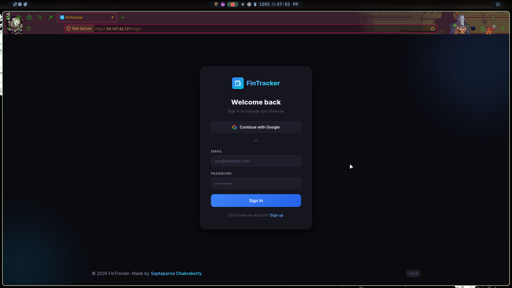

# FinTracker - A Personal Finance Tracker

This project is a modern, full-featured personal finance tracker built with **React + Vite** and **Firebase**.

---

## Tech Stack

| Technology | Purpose |
|---|---|
| React 18 + Vite | Frontend |
| React Router v6 | Client-side routing |
| Firebase Auth | User authentication |
| Firestore | Real-time database |
| Recharts | Data visualization |
| Lucide React | Icons |
| React Hot Toast | Notifications |
| date-fns | Date formatting |
| Vanilla CSS | Styling (no framework) |

---

## Containerization and Deployment (Docker + AWS EC2)

> This project is containerized using Docker and deployed on AWS EC2.

Live URL: http://54.167.42.121

### Screenshot



### Commands Used

```bash
# Connected to EC2
ssh -i <key.pem> ubuntu@<ec2-public-ip>

# Navigated inside project
cd fintracker

# Built Docker image
docker build -t fintracker .

# Ran container
docker run -d -p 80:80 fintracker

# Verified
docker ps
curl localhost
```

### Docker Image

Docker Hub: https://hub.docker.com/r/schak04/fintracker

```bash
docker pull schak04/fintracker:latest
docker run -p 8080:80 schak04/fintracker:latest
```

---

## Features

- **Authentication:** Google OAuth + Email/Password sign-in & sign-up
- **Dashboard:** Summary cards (Balance, Income, Expenses) + Charts
- **Charts:** Donut chart (expense breakdown) + Bar chart (monthly overview)
- **Transactions:** Add, Edit, Delete income/expense records
- **Filters:** Search by title, filter by type, category, and date range
- **Dark/Light Mode:** Toggle with localStorage persistence
- **Real-time:** Firestore real-time listeners for instant updates
- **Responsive:** Works on mobile, tablet, and desktop

---

## Project Structure

```
src/
├── components/
│   ├── Charts.jsx                  <- Pie + Bar charts (Recharts)
│   ├── DeleteConfirmModal.jsx
│   ├── FiltersBar.jsx              <- Search + filter controls
│   ├── Footer.jsx                  <- Page footer
│   ├── Navbar.jsx                  <- Top navigation
│   ├── ProtectedRoute.jsx          <- Auth guard
│   ├── SummaryCards.jsx            <- Balance/Income/Expense cards
│   ├── TransactionItem.jsx         <- Single transaction row
│   ├── TransactionList.jsx         <- Transaction list container
│   └── TransactionModal.jsx        <- Add/Edit form modal
├── contexts/
│   ├── AuthContext.jsx             <- Firebase auth state
│   ├── ThemeContext.jsx            <- Dark/light mode
│   └── TransactionsContext.jsx     <- Global transaction state
├── firebase/
│   └── config.js                   <- Firebase initialization
├── hooks/
│   └── useTransactions.js          <- Real-time transactions hook
├── pages/
│   ├── DashboardPage.jsx           <- Main dashboard
│   ├── LoginPage.jsx               <- Auth page
│   ├── ProfilePage.jsx             <- User profile
│   └── TransactionsPage.jsx        <- All transactions view
├── services/
│   └── transactionService.js       <- Firestore CRUD
└── utils/
    ├── categories.jsx              <- Category definitions & Lucide icons
    └── formatters.js               <- Currency & date formatters
```

---

## Author

&copy; 2026 [Saptaparno Chakraborty](https://github.com/schak04).  
All rights reserved.

---